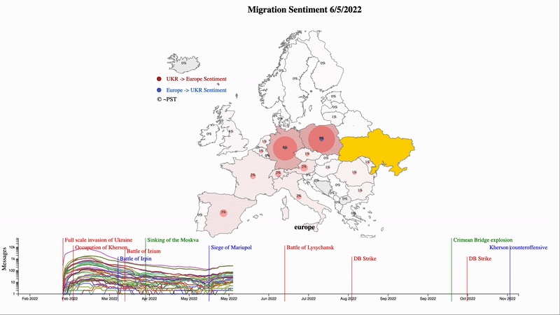

### Ukrainian Migration Flow Model

The repository contains visualization code for migration sentiment of displaced people from Ukraine collected from Telegram public channels starting from the February 2022.

For each Telegram message, we try to identify the intention of a displaced person about their migration to other European countries based on language, context, geographical location, and other attributes. Messages are further automatically classified based on inflow-outflow movement. The distribution of messages is visualized below on this map. For instance, 15% for Poland means 15% of messages during the last 14 days were about travelling to Poland.
If you have any ideas how we might improve this work, feel free to drop an email to l.m.ngo@uva.nl.

7 Feb 2023 - The border between Northern Ireland and the Republic of Ireland is missing because of the third party border data. Our apologies for the inconvenience.

### Animation of the visualization




### How to run

```
python -m http.server
```

### Versions

This model was first published in February 2023.

### License

The code is available under the [MIT licence](https://opensource.org/licenses/MIT). 

### Contributors

* Minh Ngo < l.m.ngo@uva.nl >
